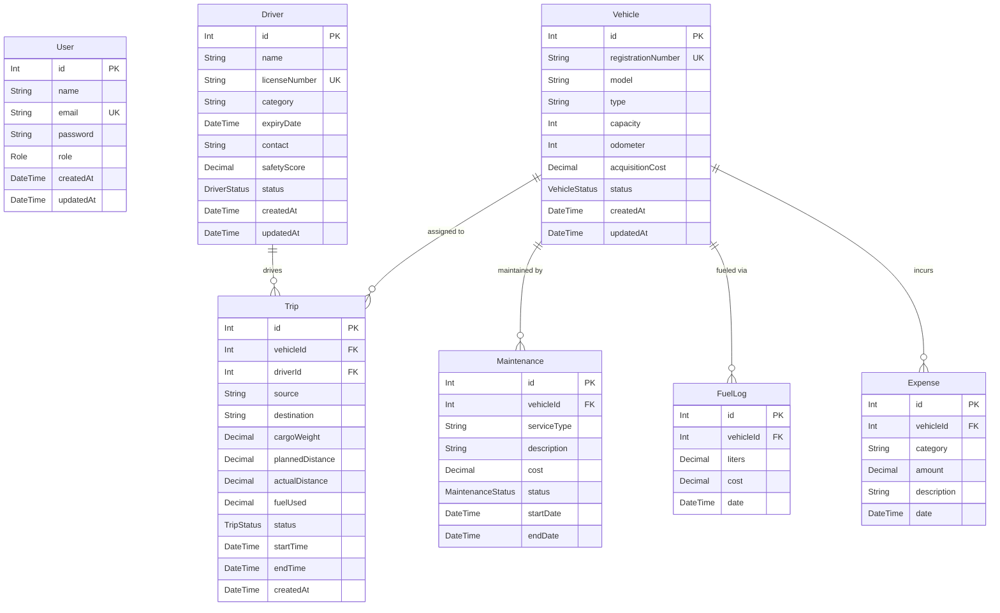

# TransitOps — Enterprise Database Documentation

## Table of Contents

1. [ER Diagram](#er-diagram)
2. [Entity Relationship Documentation](#entity-relationship-documentation)
3. [Table Documentation](#table-documentation)
4. [Field Documentation](#field-documentation)
5. [Constraint Documentation](#constraint-documentation)
6. [Index Documentation](#index-documentation)
7. [Business Rules & Lifecycles](#business-rules--lifecycles)
8. [Migration Guide](#migration-guide)
9. [Seed Guide](#seed-guide)

---

## ER Diagram



---

## Entity Relationship Documentation

| Relationship | Type | Description |
|---|---|---|
| Vehicle → Trip | 1 : N | A vehicle can be assigned to many trips over its lifetime. Each trip has exactly one vehicle. |
| Driver → Trip | 1 : N | A driver can complete many trips. Each trip has exactly one assigned driver. |
| Vehicle → Maintenance | 1 : N | A vehicle may undergo many maintenance events. Each maintenance record belongs to one vehicle. |
| Vehicle → FuelLog | 1 : N | Fuel consumption events are tracked per-vehicle over time. Each log belongs to one vehicle. |
| Vehicle → Expense | 1 : N | Operational expenses (tolls, insurance, permits) are tracked per-vehicle. Each expense belongs to one vehicle. |

### Referential Integrity

All foreign key relationships use:
- **`onDelete: Restrict`** — Prevents deletion of a Vehicle or Driver that has associated records. This avoids orphaned data and accidental data loss.
- **`onUpdate: Cascade`** — If a parent ID is updated, child records reflect the change automatically.

---

## Table Documentation

### `User`
Represents a system user with Role-Based Access Control (RBAC). Each user belongs to exactly one role, which determines their access to dashboard features and API endpoints.

### `Vehicle`
The primary asset in the fleet. Vehicles have a defined lifecycle from `AVAILABLE` through `ON_TRIP`, `IN_SHOP`, and finally `RETIRED`. All cost and utilization metrics are anchored to vehicles.

### `Driver`
A licensed operator assigned to trips. Drivers have a safety score that reflects their driving behavior and incident history. Their status tracks real-time availability.

### `Trip`
The core operational unit. A trip represents a single journey from source to destination, binding a vehicle and a driver. It tracks planned vs. actual performance metrics including distance and fuel efficiency.

### `Maintenance`
A service or repair event for a specific vehicle. Maintenance records are critical for fleet health analytics and track costs, service types, and duration.

### `FuelLog`
A record of a single refueling event for a vehicle. Used to calculate fuel efficiency (km/L) and total fuel spend per vehicle over time.

### `Expense`
A miscellaneous operational cost (toll, insurance, permit, parking) associated with a specific vehicle. Enables expense reporting by category, vehicle, or time period.

---

## Field Documentation

### User
| Field | Type | Description |
|---|---|---|
| `id` | Int (PK, autoincrement) | Unique identifier |
| `name` | String | Full name of the user |
| `email` | String (UNIQUE) | Login email address |
| `password` | String | Bcrypt-hashed password |
| `role` | Role (enum) | System role for RBAC |
| `createdAt` | DateTime | Account creation timestamp |
| `updatedAt` | DateTime | Last modification timestamp |

### Vehicle
| Field | Type | Description |
|---|---|---|
| `id` | Int (PK, autoincrement) | Unique identifier |
| `registrationNumber` | String (UNIQUE) | Government-issued vehicle registration |
| `model` | String | Make and model (e.g. Tata Signa) |
| `type` | String | Category (Truck, LCV, Trailer, etc.) |
| `capacity` | Int | Cargo capacity in kg |
| `odometer` | Int | Current odometer reading in km |
| `acquisitionCost` | Decimal(10,2) | Purchase cost in INR |
| `status` | VehicleStatus (enum) | Current operational status |
| `createdAt` | DateTime | Record creation timestamp |
| `updatedAt` | DateTime | Last modification timestamp |

### Driver
| Field | Type | Description |
|---|---|---|
| `id` | Int (PK, autoincrement) | Unique identifier |
| `name` | String | Full name |
| `licenseNumber` | String (UNIQUE) | Government-issued license number |
| `category` | String | License category (Light, Heavy, Commercial) |
| `expiryDate` | DateTime | License expiry date |
| `contact` | String | Mobile contact number |
| `safetyScore` | Decimal(5,2) | Safety rating (0.00 – 100.00) |
| `status` | DriverStatus (enum) | Current availability status |
| `createdAt` | DateTime | Record creation timestamp |
| `updatedAt` | DateTime | Last modification timestamp |

### Trip
| Field | Type | Description |
|---|---|---|
| `id` | Int (PK, autoincrement) | Unique identifier |
| `vehicleId` | Int (FK → Vehicle) | Assigned vehicle |
| `driverId` | Int (FK → Driver) | Assigned driver |
| `source` | String | Trip origin location |
| `destination` | String | Trip destination |
| `cargoWeight` | Decimal(10,2) | Cargo weight in kg (must not exceed vehicle capacity) |
| `plannedDistance` | Decimal(10,2) | Pre-planned distance in km |
| `actualDistance` | Decimal(10,2)? | Actual distance covered (null if not completed) |
| `fuelUsed` | Decimal(10,2)? | Fuel consumed in liters (null if not completed) |
| `status` | TripStatus (enum) | Current trip status |
| `startTime` | DateTime | Scheduled/actual start time |
| `endTime` | DateTime? | Completion time (null if ongoing or not completed) |
| `createdAt` | DateTime | Record creation timestamp |

### Maintenance
| Field | Type | Description |
|---|---|---|
| `id` | Int (PK, autoincrement) | Unique identifier |
| `vehicleId` | Int (FK → Vehicle) | Vehicle under service |
| `serviceType` | String | Type of service (e.g. Engine Overhaul, Oil Change) |
| `description` | String | Detailed description of work done |
| `cost` | Decimal(10,2) | Total service cost in INR |
| `status` | MaintenanceStatus (enum) | Current maintenance status |
| `startDate` | DateTime | Service start date |
| `endDate` | DateTime? | Service completion date (null if ongoing) |

### FuelLog
| Field | Type | Description |
|---|---|---|
| `id` | Int (PK, autoincrement) | Unique identifier |
| `vehicleId` | Int (FK → Vehicle) | Vehicle refueled |
| `liters` | Decimal(10,2) | Volume of fuel added |
| `cost` | Decimal(10,2) | Total fuel cost in INR |
| `date` | DateTime | Date and time of refueling |

### Expense
| Field | Type | Description |
|---|---|---|
| `id` | Int (PK, autoincrement) | Unique identifier |
| `vehicleId` | Int (FK → Vehicle) | Vehicle associated with expense |
| `category` | String | Expense type (Toll, Insurance, Repair, Permit, Parking) |
| `amount` | Decimal(10,2) | Expense amount in INR |
| `description` | String | Detailed description |
| `date` | DateTime | Date of expense |

---

## Constraint Documentation

### Unique Constraints
| Table | Field | Reason |
|---|---|---|
| `User` | `email` | Prevents duplicate accounts |
| `Vehicle` | `registrationNumber` | Each vehicle has one government-issued registration |
| `Driver` | `licenseNumber` | Each driver has one government-issued license |

### CHECK Constraints (enforced in PostgreSQL via migration)
| Table | Constraint | Rule |
|---|---|---|
| `Vehicle` | `Vehicle_odometer_check` | `odometer >= 0` |
| `Vehicle` | `Vehicle_acquisitionCost_check` | `acquisitionCost >= 0` |
| `Driver` | `Driver_safetyScore_check` | `safetyScore >= 0 AND safetyScore <= 100` |
| `Trip` | `Trip_cargoWeight_check` | `cargoWeight > 0` |
| `Trip` | `Trip_plannedDistance_check` | `plannedDistance > 0` |
| `Trip` | `Trip_actualDistance_check` | `actualDistance >= 0` |
| `Trip` | `Trip_fuelUsed_check` | `fuelUsed >= 0` |
| `Maintenance` | `Maintenance_cost_check` | `cost >= 0` |
| `FuelLog` | `FuelLog_liters_check` | `liters > 0` |
| `FuelLog` | `FuelLog_cost_check` | `cost >= 0` |
| `Expense` | `Expense_amount_check` | `amount >= 0` |

### Referential Actions
| FK Relationship | onDelete | onUpdate |
|---|---|---|
| Trip → Vehicle | Restrict | Cascade |
| Trip → Driver | Restrict | Cascade |
| Maintenance → Vehicle | Restrict | Cascade |
| FuelLog → Vehicle | Restrict | Cascade |
| Expense → Vehicle | Restrict | Cascade |

---

## Index Documentation

| Table | Index | Columns | Purpose |
|---|---|---|---|
| `User` | `User_role_idx` | `role` | Filter users by role in admin panels |
| `Vehicle` | `Vehicle_status_idx` | `status` | Fleet utilization dashboards (filter by AVAILABLE, ON_TRIP, etc.) |
| `Driver` | `Driver_status_idx` | `status` | Driver availability queries |
| `Trip` | `Trip_vehicleId_idx` | `vehicleId` | Lookup all trips for a vehicle |
| `Trip` | `Trip_driverId_idx` | `driverId` | Lookup all trips for a driver |
| `Trip` | `Trip_status_idx` | `status` | Filter trips by status |
| `Trip` | `Trip_startTime_endTime_idx` | `startTime, endTime` | Date-range analytics queries |
| `Maintenance` | `Maintenance_vehicleId_idx` | `vehicleId` | Vehicle maintenance history |
| `Maintenance` | `Maintenance_status_idx` | `status` | Open/active maintenance dashboard |
| `Maintenance` | `Maintenance_startDate_endDate_idx` | `startDate, endDate` | Maintenance cost analytics |
| `FuelLog` | `FuelLog_vehicleId_idx` | `vehicleId` | Per-vehicle fuel consumption |
| `FuelLog` | `FuelLog_date_idx` | `date` | Fuel spend over time |
| `Expense` | `Expense_vehicleId_idx` | `vehicleId` | Per-vehicle expense history |
| `Expense` | `Expense_date_category_idx` | `date, category` | Category-wise expense reporting |

---

## Business Rules & Lifecycles

### Vehicle Lifecycle

```
AVAILABLE
    │
    ├── Dispatched on a Trip ──► ON_TRIP
    │                                │
    │                         Trip Completes ──► AVAILABLE
    │
    ├── Scheduled for Service ──► IN_SHOP
    │                                 │
    │                       Service Completed ──► AVAILABLE
    │
    └── End of Service ──► RETIRED
```

**Rules:**
- A vehicle in `ON_TRIP` status **must** have exactly one active `DISPATCHED` trip.
- A vehicle in `IN_SHOP` status **must** have at least one `OPEN` or `IN_PROGRESS` maintenance record.
- A `RETIRED` vehicle cannot be assigned new trips or maintenance.

### Driver Lifecycle

```
AVAILABLE
    │
    ├── Assigned to a Trip ──► ON_TRIP
    │                             │
    │                      Trip Completes ──► AVAILABLE
    │
    ├── Personal Leave / Unavailable ──► OFF_DUTY
    │                                        │
    │                                  Returns ──► AVAILABLE
    │
    └── Disciplinary / Safety Violation ──► SUSPENDED
```

**Rules:**
- A driver in `ON_TRIP` status **must** be assigned to an active `DISPATCHED` trip.
- A `SUSPENDED` driver cannot be assigned to any new trips.
- A driver with an expired `expiryDate` must not be assigned trips.

### Trip Lifecycle

```
DRAFT
  │
  └── Approved & Dispatched ──► DISPATCHED
                                     │
                    ┌────────────────┼────────────────┐
                    │                                  │
            Trip Completes                     Trip Aborted
                    │                                  │
              COMPLETED                           CANCELLED
```

**Rules:**
- A trip must have `actualDistance` and `fuelUsed` set when moving to `COMPLETED`.
- A `CANCELLED` trip does not require actual distance or fuel data.
- `cargoWeight` **must not exceed** the assigned vehicle's `capacity`.
- `endTime` is required for `COMPLETED` trips.

### Maintenance Lifecycle

```
OPEN
  │
  └── Work Begins ──► IN_PROGRESS
                           │
                    Work Finished ──► COMPLETED
```

**Rules:**
- `endDate` is populated only when status transitions to `COMPLETED`.
- A vehicle remains in `IN_SHOP` status for the full duration of any `OPEN` or `IN_PROGRESS` maintenance record.

---

## Migration Guide

### Initial Setup (first time)

1. Ensure PostgreSQL is running.
2. Create the database:
   ```sql
   CREATE DATABASE transitops;
   ```
3. Set your `DATABASE_URL` in `server/.env`:
   ```
   DATABASE_URL="postgresql://<user>:<password>@localhost:5432/transitops?schema=public"
   ```
4. Apply all migrations:
   ```bash
   cd server
   npx prisma migrate deploy
   ```

### Development Workflow

To create a new migration after schema changes:
```bash
cd server
npx prisma migrate dev --name <descriptive_name>
```

To check migration status:
```bash
npx prisma migrate status
```

To reset database and re-apply all migrations:
```bash
npm run db:reset
```

### Production Deployment

> [!IMPORTANT]
> Never run `prisma migrate dev` in production. Use `migrate deploy` instead.

```bash
npx prisma migrate deploy
```

### Available Scripts

| Command | Description |
|---|---|
| `npm run prisma:migrate` | Run new migrations in dev mode |
| `npm run prisma:generate` | Regenerate Prisma Client |
| `npm run prisma:seed` | Run the seed file |
| `npm run db:reset` | Reset database and re-run all migrations |

---

## Seed Guide

The seed file at `server/prisma/seed.ts` generates a full enterprise demo dataset.

### What it creates

| Entity | Count | Notes |
|---|---|---|
| Users | 5 | One per role |
| Vehicles | 50 | Mixed statuses including ON_TRIP, IN_SHOP, RETIRED |
| Drivers | 75 | Mixed statuses, varied safety scores |
| Trips | 250 | 10 active (DISPATCHED), ~216 COMPLETED, ~24 CANCELLED |
| Maintenance | 80 | 5 active (OPEN/IN_PROGRESS), 75 COMPLETED |
| Fuel Logs | 120 | Spread over past 6 months |
| Expenses | 200 | Multiple categories, spread over past 6 months |

### Running the Seed

```bash
cd server
npx prisma db seed
# or
npm run prisma:seed
```

### Idempotency

The seed is **fully idempotent**: it deletes all existing data and re-creates from scratch. This means it is safe to run multiple times without duplication.

> [!WARNING]
> Running the seed **erases all existing data**. Do not run against a production database.

### Data Integrity Guarantees

The seed strictly respects all business rules:
- Vehicles marked `ON_TRIP` are paired with matching `DISPATCHED` trips.
- Vehicles marked `IN_SHOP` are paired with `OPEN` or `IN_PROGRESS` maintenance records.
- Drivers marked `ON_TRIP` are assigned to the active dispatched trips.
- Cargo weight for every trip is capped to the vehicle's capacity.
- All completed trips include `actualDistance` and `fuelUsed` values.
